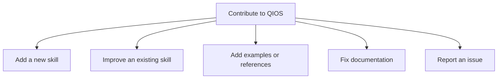
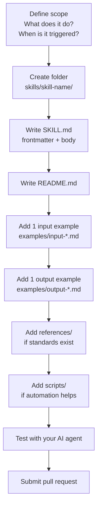

# Contributing to QIOS

> **Navigation:** [← README](README.md) · [Architecture](docs/architecture.md) · [Usage Guide](docs/usage.md)

Thank you for your interest in contributing to QIOS.
This document explains how to add skills, improve existing ones, and report issues.

---

## Table of Contents

- [Ways to contribute](#ways-to-contribute)
- [Adding a new skill](#adding-a-new-skill)
- [Improving an existing skill](#improving-an-existing-skill)
- [Skill quality checklist](#skill-quality-checklist)
- [Reporting issues](#reporting-issues)
- [Code style](#code-style)

---

## Ways to contribute



---

## Adding a new skill

### When is a new skill justified?

A new skill is justified when:
- It covers a distinct QA task not handled by existing skills
- It would be triggered by clearly different user requests
- It has a well-defined input, process, and output

A new skill is **not** justified when:
- It slightly overlaps an existing skill (extend it instead)
- It only changes the output format of an existing skill

### Process



### Minimum requirements for a new skill

- [ ] `SKILL.md` with valid frontmatter (`name` + `description`)
- [ ] `README.md` with when/how/what sections
- [ ] At least 1 input example in `examples/`
- [ ] At least 1 output example in `examples/`
- [ ] Description includes at least 3 real trigger phrases
- [ ] Output format is clearly defined in SKILL.md

---

## Improving an existing skill

To improve a SKILL.md:

1. **Test the current skill** — run it on 3–5 real requests
2. **Identify the gap** — what is missing or inconsistent?
3. **Edit the minimum** — avoid unnecessary rewrites
4. **Update examples** if the output format changes
5. **Update CHANGELOG.md**

### What to improve

| Issue | Where to fix |
|---|---|
| Skill not triggered when it should be | Improve `description` trigger phrases |
| Output missing a category | Add to the Process or Output Format section |
| Missing edge case coverage | Add to the relevant examples |
| Broken script | Fix in `scripts/` |

---

## Skill quality checklist

Before submitting or merging a skill:

```
SKILL.md
  [ ] name is lowercase, hyphenated, unique
  [ ] description includes 3+ specific trigger phrases
  [ ] description says both WHAT it does and WHEN to use it
  [ ] Process section is step-by-step, not vague
  [ ] Output Format section includes a real template
  [ ] References section points to actual files

README.md
  [ ] "When to use" section is concrete, not generic
  [ ] "How to trigger" section includes copy-paste examples
  [ ] "What you get" is specific, numbered
  [ ] "Related skills" section present

examples/
  [ ] At least 1 realistic input file
  [ ] At least 1 realistic output file that matches the SKILL.md output format
  [ ] Output example is complete, not truncated

references/
  [ ] Every referenced file actually exists
  [ ] No placeholder content — all checklists are complete
```

---

## Reporting issues

Open an issue with:
- **Skill name** affected
- **Trigger phrase** you used
- **Expected output** vs **actual output**
- **AI agent** you used (Claude / Codex / Cursor)

---

## Code style

| File type | Convention |
|---|---|
| Markdown | ATX headers (`#`), fenced code blocks, tables over bullet lists |
| JavaScript | 2-space indent, single quotes, semicolons |
| Bash | `#!/bin/bash`, `set -e`, descriptive comments |
| JSON | 2-space indent, no trailing commas |
| Gherkin | 2-space indent, blank line between scenarios |

---

> **Navigation:** [← README](README.md) · [Architecture](docs/architecture.md) · [Usage Guide](docs/usage.md)
