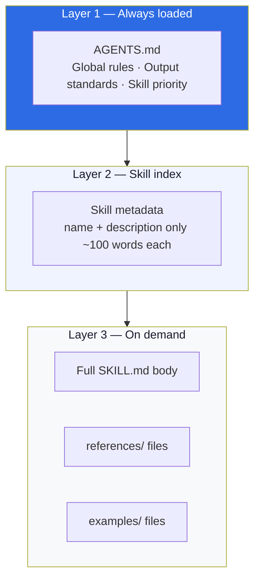
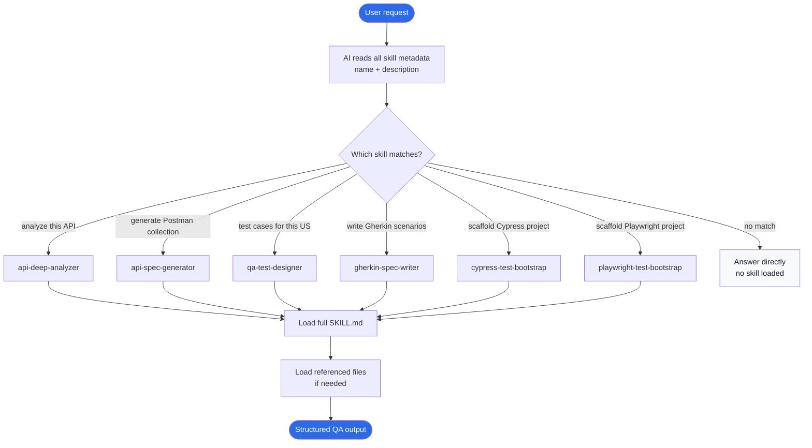
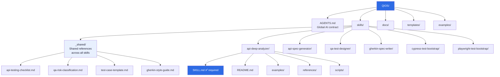
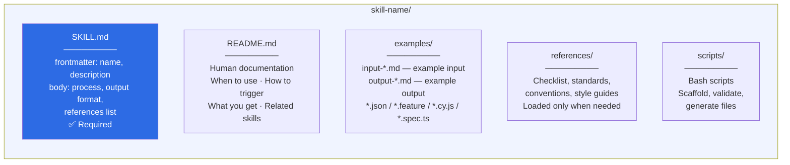
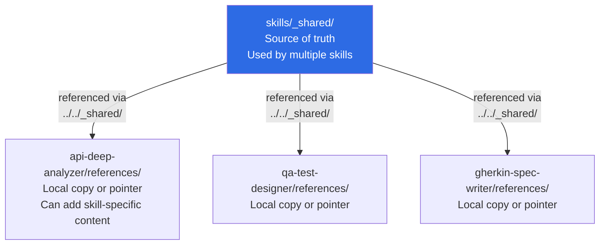
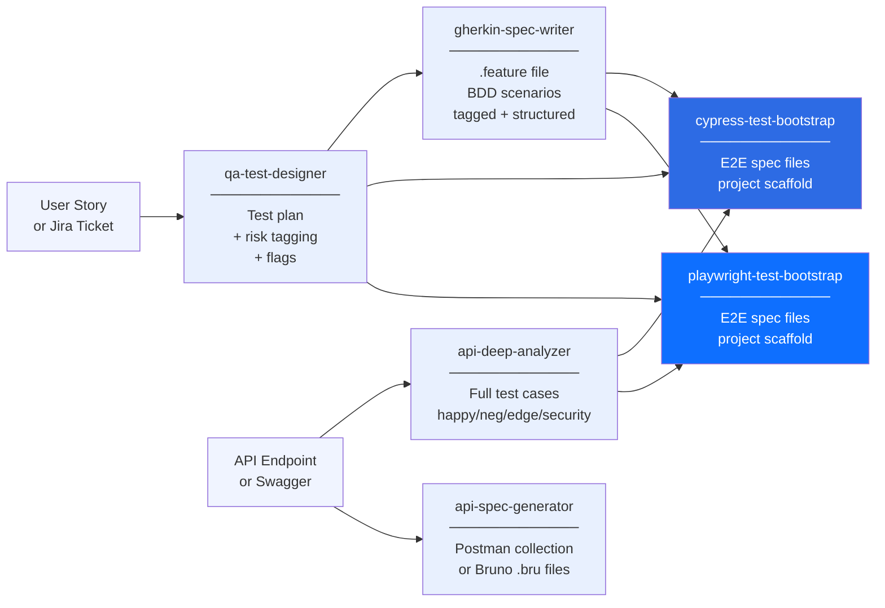

# QIOS — Architecture

> **Navigation:** [← README](../README.md) · [Usage Guide →](usage.md) · [Examples →](examples.md)

---

## Table of Contents

- [Overview](#overview)
- [Loading Mechanism](#loading-mechanism)
- [Skill Selection Flow](#skill-selection-flow)
- [Directory Structure](#directory-structure)
- [Skill Anatomy](#skill-anatomy)
- [_shared vs references](#shared-vs-references)
- [QA Workflow Integration](#qa-workflow-integration)

---

## Overview

QIOS operates as a three-layer memory system for AI agents:



---

## Loading Mechanism

| Level | Content | When loaded | Size |
|---|---|---|---|
| **1** | `AGENTS.md` | Every session — always | ~500 words |
| **2** | Skill `name` + `description` (all skills) | Every session — always | ~100 words/skill |
| **3** | Full `SKILL.md` body + `references/` | Only when skill is triggered | Variable |

**Key principle:** The AI never loads everything at once.
It selects the right skill, then reads only what it needs for the task.

---

## Skill Selection Flow



---

## Directory Structure



---

## Skill Anatomy

Every skill follows the same structure:



### SKILL.md frontmatter

```yaml
---
name: skill-identifier          # Short name — used for skill selection
description: >                  # PRIMARY triggering mechanism
  What this skill does.         # Be specific — include real trigger phrases
  When to use it.               # The AI matches user requests against this
  Triggers on: "phrase 1",
  "phrase 2", "phrase 3".
---
```

---

## _shared vs references



| Location | Purpose | Update strategy |
|---|---|---|
| `skills/_shared/` | Master reference — single source of truth | Edit here only |
| `skills/[name]/references/` | Local pointer + skill-specific additions | Point to `_shared/`, extend if needed |

---

## QA Workflow Integration

QIOS skills map directly to a complete QA workflow:



Each skill output feeds naturally into the next.
A single feature can flow through all 6 skills in sequence.

---

> **Navigation:** [← README](../README.md) · [Usage Guide →](usage.md) · [Examples →](examples.md)
