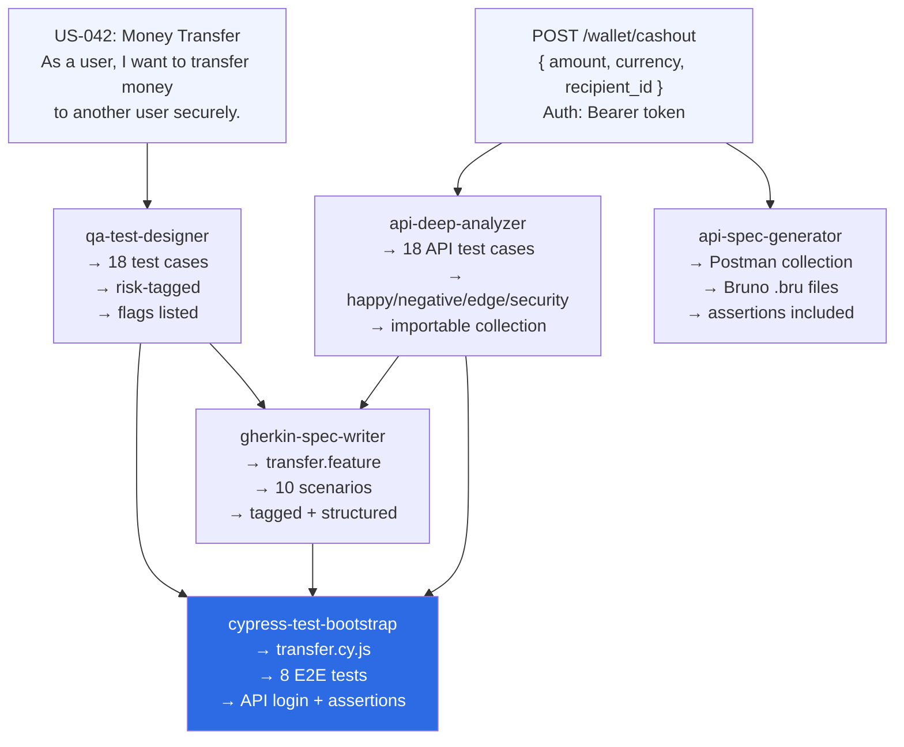
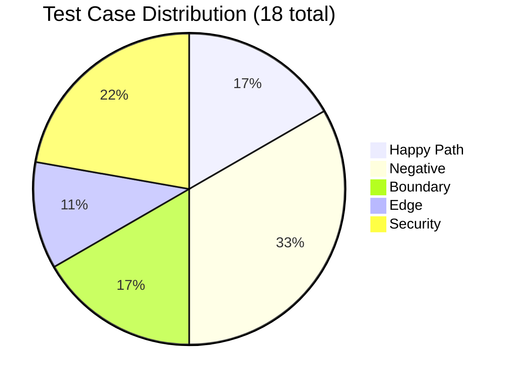
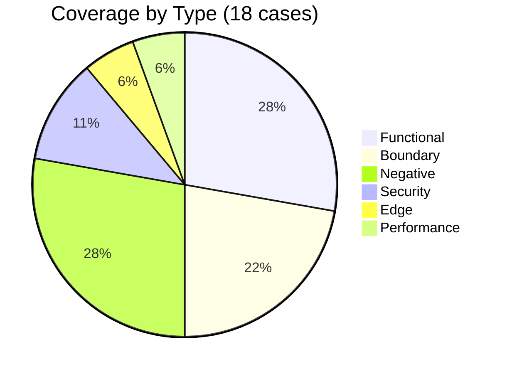
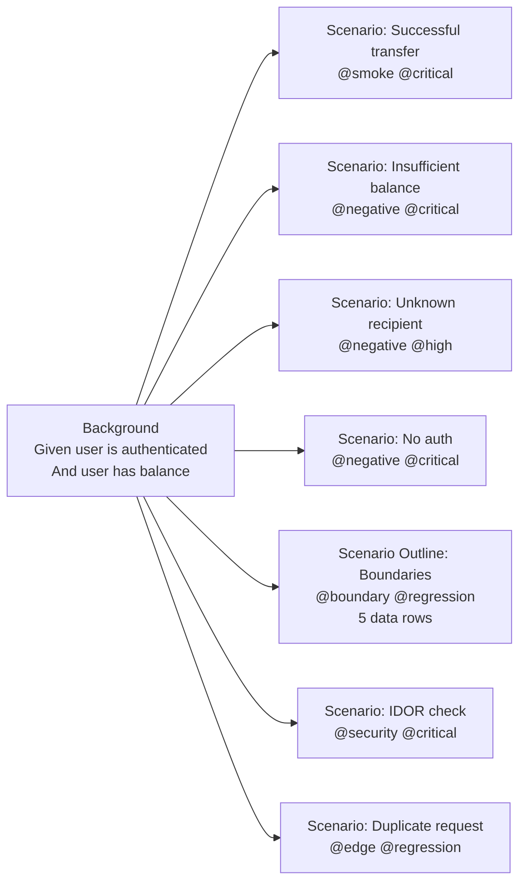
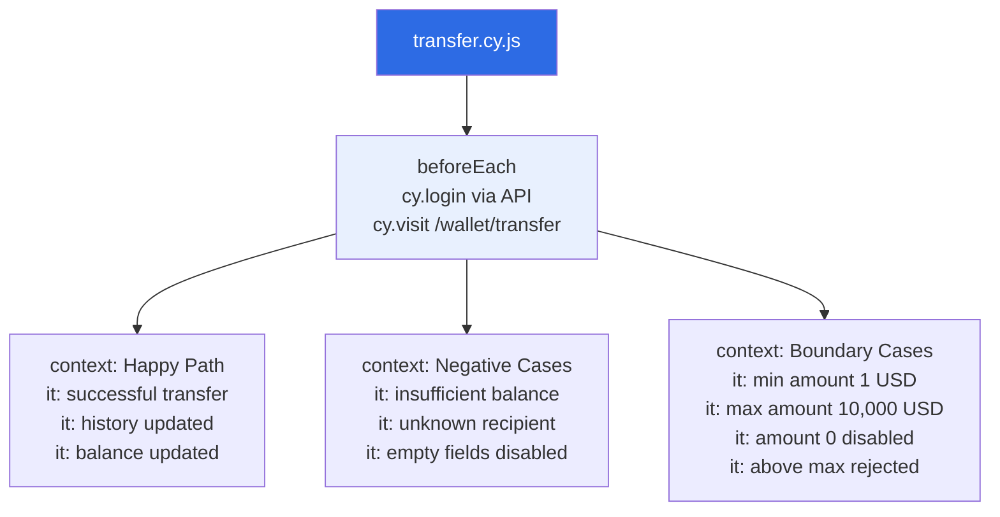
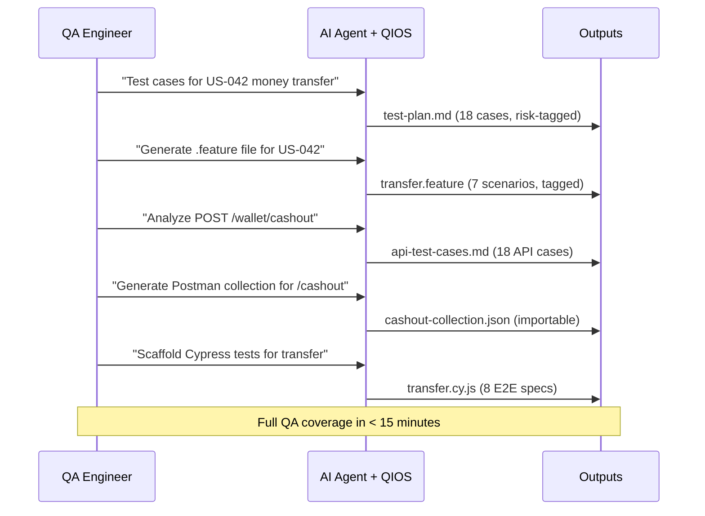

# QIOS — Real-World Examples

> **Navigation:** [← Usage Guide](usage.md) · [← Architecture](architecture.md) · [← README](../README.md)

---

## Table of Contents

- [Full workflow overview](#full-workflow-overview)
- [Example 1 — api-deep-analyzer](#example-1--api-deep-analyzer)
- [Example 2 — api-spec-generator](#example-2--api-spec-generator)
- [Example 3 — qa-test-designer](#example-3--qa-test-designer)
- [Example 4 — gherkin-spec-writer](#example-4--gherkin-spec-writer)
- [Example 5 — cypress-test-bootstrap](#example-5--cypress-test-bootstrap)
- [End-to-end walkthrough](#end-to-end-walkthrough)

---

## Full workflow overview

All 5 examples below are based on the same feature: **Money Transfer**.



---

## Example 1 — api-deep-analyzer

**Input:** `POST /wallet/cashout` — financial transaction endpoint

**Prompt:**
```
Analyze POST /wallet/cashout and generate all test cases.
Auth: Bearer token. Body: { amount: number, currency: string, recipient_id: string }
Rules: amount 1–10000, recipient must exist, user must have sufficient balance.
```

**What QIOS produces:**



| Output | Details |
|---|---|
| **API Profile** | Method, auth, fields, business goal, risk domain |
| **18 test cases** | Structured table with ID, category, test data, expected result |
| **Risk tags** | [CRITICAL] · [HIGH] · [MEDIUM] · [LOW] per case |
| **Flags** | [MISSING] and [ASSUMPTION] clearly listed |

📄 **Full output:** [examples/api/cashout-test-cases.md](../examples/api/cashout-test-cases.md)

---

## Example 2 — api-spec-generator

**Input:** Same endpoint — need an importable collection

**Prompt:**
```
Generate a Postman collection for POST /wallet/cashout.
Include: happy path, missing amount, no auth, negative amount, SQL injection.
```

**What QIOS produces:**

| Output | Details |
|---|---|
| **Postman JSON** | Collection v2.1 — import via File → Import |
| **Environment vars** | `{{base_url}}`, `{{token}}` pre-configured |
| **Auth** | Bearer token pre-wired on every request |
| **Assertions** | Status code, response time, Content-Type, body fields |
| **Bruno** | `.bru` files + `bruno.json` manifest |

📄 **Full output:** [examples/api/cashout-collection.json](../examples/api/cashout-collection.json)

---

## Example 3 — qa-test-designer

**Input:** User Story US-042

**Prompt:**
```
Write a test plan for US-042:
As a user, I want to transfer money to another user.
Rules: authenticated, amount 1–10,000 USD, recipient must be active, sufficient balance required.
```

**What QIOS produces:**



| Output | Details |
|---|---|
| **Test plan header** | Feature name, reference, total cases, coverage summary |
| **18 test cases** | ID, title, category, priority, expected result, risk |
| **Flags section** | 3× [MISSING] · 2× [ASSUMPTION] |
| **Next steps** | Pointers to gherkin-spec-writer + api-deep-analyzer |

📄 **Full output:** [skills/qa-test-designer/examples/output-test-plan.md](../skills/qa-test-designer/examples/output-test-plan.md)

---

## Example 4 — gherkin-spec-writer

**Input:** US-042 acceptance criteria

**Prompt:**
```
Generate a .feature file for US-042 — money transfer.
Rules: authenticated, amount 1–10,000 USD, recipient active, sufficient balance.
```

**What QIOS produces:**



| Output | Details |
|---|---|
| **Feature header** | Role, goal, benefit |
| **Background** | Shared auth precondition |
| **7 scenarios** | Including 1 Outline with 5 rows = 11 executions |
| **Tags** | @smoke · @critical · @negative · @boundary · @security · @edge |

📄 **Full output:** [examples/gherkin/transfer.feature](../examples/gherkin/transfer.feature)

---

## Example 5 — cypress-test-bootstrap

**Input:** Money transfer feature to automate

**Prompt:**
```
Generate a Cypress spec for the money transfer feature.
Cover: happy path, insufficient balance, unknown recipient, boundary amounts.
```

**What QIOS produces:**



| Output | Details |
|---|---|
| **8 test cases** | Happy path + negative + boundary |
| **API login** | `cy.login()` in `beforeEach` for authenticated flows |
| **Assertions** | `.should()` only — zero `cy.wait(ms)` |
| **Selectors** | `data-testid` exclusively |

📄 **Full output:** [examples/cypress/transfer.cy.js](../examples/cypress/transfer.cy.js)

---

## End-to-end walkthrough

The complete QA workflow for a single feature using all 5 QIOS skills:



---

> **Navigation:** [← Usage Guide](usage.md) · [← Architecture](architecture.md) · [← README](../README.md)
