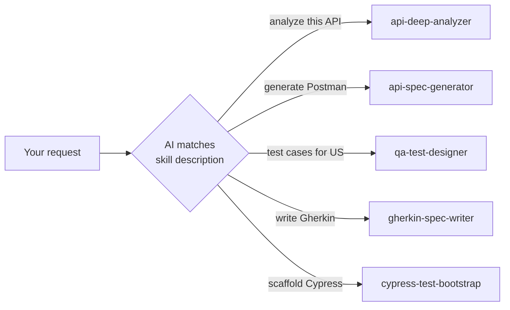
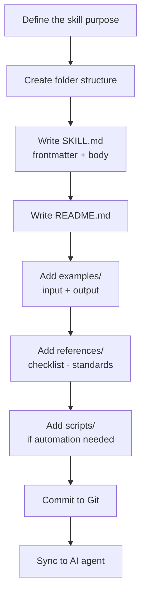

# QIOS — Usage Guide

> **Navigation:** [← Architecture](architecture.md) · [← README](../README.md) · [Examples →](examples.md)

---

## Table of Contents

- [Installation](#installation)
  - [Codex — global](#codex--global)
  - [Claude Projects](#claude-projects)
  - [Per project](#per-project)
- [How to trigger a skill](#how-to-trigger-a-skill)
  - [Automatic](#automatic-recommended)
  - [Forced](#forced)
- [Add a new skill](#add-a-new-skill)
- [Update QIOS](#update-qios)
- [SKILL.md reference](#skillmd-reference)

---

## Installation

### Codex — global

Installs QIOS for all your projects. Skills auto-load on every Codex session.

```bash
git clone https://github.com/mahmoumaima/QIOS.git

# Install skills globally
cp -r QIOS/skills/* ~/.codex/skills/

# Install global working agreement
cp QIOS/AGENTS.md ~/.codex/AGENTS.md
```

**Result:**
```
~/.codex/
├── AGENTS.md
└── skills/
    ├── api-deep-analyzer/
    ├── api-spec-generator/
    ├── qa-test-designer/
    ├── gherkin-spec-writer/
    └── cypress-test-bootstrap/
```

---

### Claude Projects

1. Open your Claude Project
2. Go to **Project Instructions**
3. Paste the full content of [`AGENTS.md`](../AGENTS.md)
4. For each skill you want active, paste its `SKILL.md` content

> **Tip:** Start with `api-deep-analyzer` and `qa-test-designer` — they cover the most common QA requests.

---

### Per project

Scopes QIOS to a single repository.

```bash
# In your project root
mkdir -p .codex/skills
cp -r QIOS/skills/* .codex/skills/
cp QIOS/AGENTS.md .codex/AGENTS.md
```

---

## How to trigger a skill

### Automatic (recommended)

Describe what you need in natural language — the AI matches your request against skill descriptions and selects the right one.



**Examples:**

```
"Analyze POST /payment/transfer and generate all test cases"
→ api-deep-analyzer

"Generate a Postman collection from this Swagger spec: [paste]"
→ api-spec-generator

"Write test cases for US-042: [paste user story]"
→ qa-test-designer

"Generate the .feature file for the login feature"
→ gherkin-spec-writer

"Scaffold a Cypress project for the checkout module"
→ cypress-test-bootstrap
```

---

### Forced

When you need a specific skill regardless of the request wording:

```
"Use the api-deep-analyzer skill to analyze DELETE /users/{id}"
"With gherkin-spec-writer, generate Gherkin for this US"
"Apply qa-test-designer to this ticket: [paste]"
```

---

## Add a new skill



**Step by step:**

```bash
# 1. Create folder structure
mkdir -p skills/my-new-skill/{examples,references,scripts}

# 2. Create SKILL.md
cat > skills/my-new-skill/SKILL.md << 'SKILL'
---
name: my-new-skill
description: >
  What this skill does. When to use it.
  Triggers on: "trigger phrase 1", "trigger phrase 2".
---

# My New Skill

## Purpose

## Input Accepted

## Process

## Output Format

## References
SKILL

# 3. Create README.md
# 4. Add examples/ and references/
# 5. Commit
git add skills/my-new-skill/
git commit -m "feat(skills): add my-new-skill"

# 6. Sync
cp -r skills/my-new-skill ~/.codex/skills/
```

> See [CONTRIBUTING.md](../CONTRIBUTING.md) for full guidelines.

---

## Update QIOS

```bash
cd QIOS
git pull origin main

# Sync updated skills
cp -r skills/* ~/.codex/skills/
cp AGENTS.md ~/.codex/AGENTS.md

echo "QIOS updated ✅"
```

---

## SKILL.md reference

### Frontmatter fields

| Field | Required | Purpose |
|---|---|---|
| `name` | ✅ | Short identifier used in skill selection |
| `description` | ✅ | **Primary triggering mechanism** — include specific trigger phrases |
| `compatibility` | ❌ | Required tools or dependencies (rare) |

### Description writing guide

The `description` field is the most important part of any skill.
The AI matches user requests against it to decide which skill to load.

```yaml
# ✅ Good — specific, includes real trigger phrases
description: >
  Deeply analyze an API endpoint and generate complete test coverage.
  Triggers on: "analyze this API", "generate test cases for this endpoint",
  "what should I test on this API", "API test design".

# ❌ Bad — too vague, no trigger phrases
description: >
  Helps with API testing.
```

### SKILL.md body sections

```markdown
## Purpose          ← One paragraph — what problem this solves
## Input Accepted   ← What the user provides
## Process          ← Step-by-step what the AI does
## Output Format    ← What the AI produces, with templates
## References       ← Pointers to examples/ and references/ files
```

---

> **Navigation:** [← Architecture](architecture.md) · [← README](../README.md) · [Examples →](examples.md)
