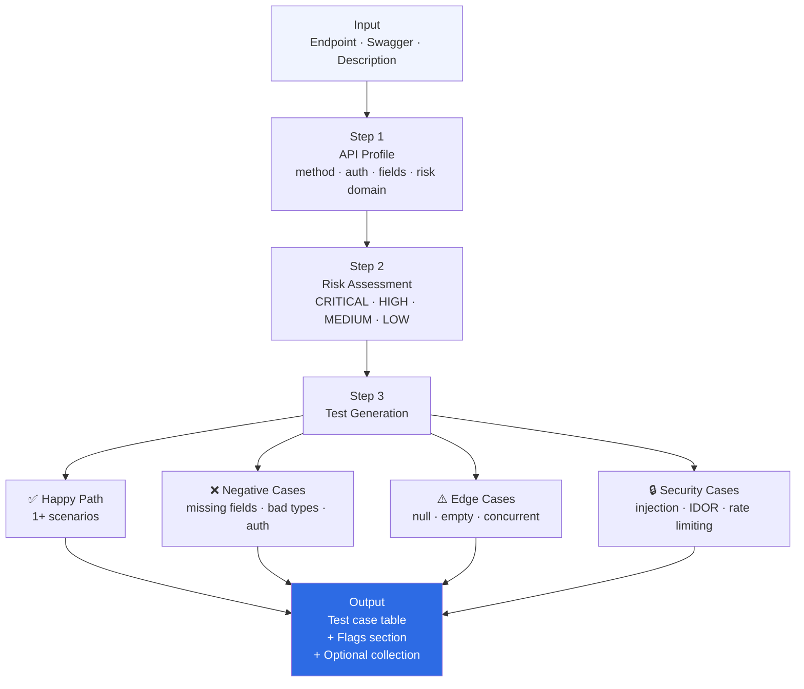

> **Navigation:** [← Skills Overview](../../README.md#skills) · [Architecture](../../docs/architecture.md) · [Usage Guide](../../docs/usage.md)

---

# Skill — api-deep-analyzer

Deeply analyze an API endpoint and generate complete, structured test coverage.

---

## When to use

- You have an endpoint and need full test coverage fast
- You want zero forgotten edge cases or security checks
- You need a structured, risk-tagged test set ready to execute

## How to trigger

```
"Analyze POST /orders/checkout and generate all test cases"
"What should I test on this endpoint?"
"Generate test coverage for DELETE /users/{id}"
"Give me all test cases for this API: [paste endpoint]"
```

## What you get

1. **API Profile** — method, auth, fields, business goal, risk
2. **Test Cases** — happy path + negative + boundary + edge + security
3. **Risk tags** — [CRITICAL] [HIGH] [MEDIUM] [LOW] per case
4. **Flags** — [MISSING] and [ASSUMPTION] clearly listed

## Files

| File | Purpose |
|---|---|
| `SKILL.md` | AI instructions — core logic |
| `README.md` | This file — human documentation |
| `examples/input-endpoint.md` | Example endpoint input |
| `examples/output-test-cases.md` | Example generated test cases |
| `references/api-testing-checklist.md` | Complete verification checklist |
| `scripts/validate-coverage.sh` | Script to verify test coverage completeness |

## Related skills

- `api-spec-generator` — generate a Postman/Bruno collection from the same endpoint
- `gherkin-spec-writer` — convert test cases to Gherkin `.feature` file

---

## How it works



---

> **Navigation:** [← Skills Overview](../../README.md#skills) · [Architecture](../../docs/architecture.md) · [Examples](../../docs/examples.md#example-1--api-deep-analyzer)
