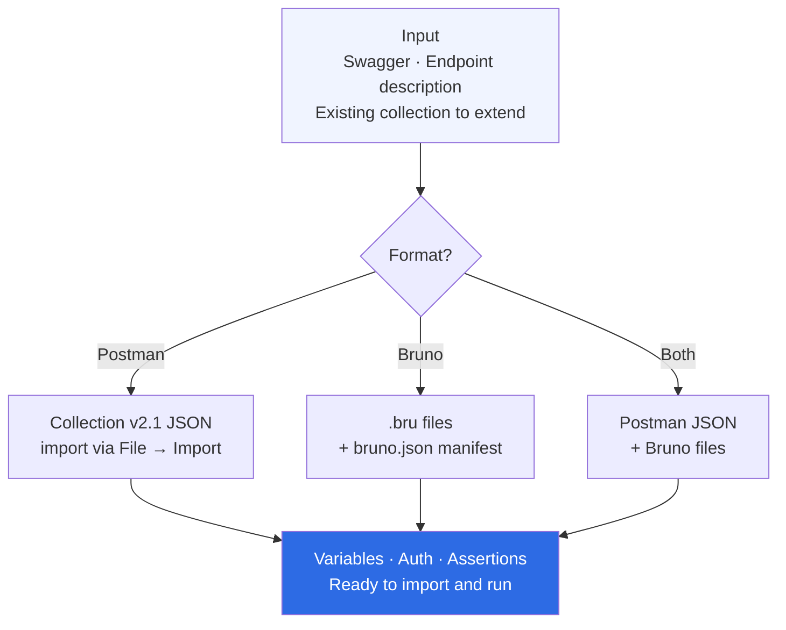

> **Navigation:** [← Skills Overview](../../README.md#skills) · [Architecture](../../docs/architecture.md) · [Usage Guide](../../docs/usage.md)

---

# Skill — api-spec-generator

Generate importable Postman or Bruno collections from any API spec or endpoint.

---

## When to use

- You have a Swagger/OpenAPI spec and want a ready-to-import collection
- You want to share a pre-configured collection with your team
- You need to bootstrap API tests from an endpoint description

## How to trigger

```
"Generate a Postman collection for POST /wallet/cashout"
"Create a Bruno collection from this Swagger spec"
"Give me an import-ready Postman file for these endpoints"
"Export this API as a Bruno collection"
```

## What you get

- **Postman**: Collection v2.1 JSON — import directly via File → Import
- **Bruno**: `.bru` files + `bruno.json` manifest
- Environment variables pre-configured (`{{base_url}}`, `{{token}}`)
- Bearer auth pre-wired
- Test assertions included per request

## Files

| File | Purpose |
|---|---|
| `SKILL.md` | AI instructions — core logic |
| `README.md` | This file |
| `examples/input-swagger.json` | Example Swagger/OpenAPI input |
| `examples/output-postman.json` | Complete Postman collection output |
| `examples/output-bruno/bruno.json` | Bruno collection manifest |
| `examples/output-bruno/cashout.bru` | Bruno request file |
| `references/api-standards.md` | Naming and organization conventions |
| `scripts/generate-collection.sh` | CLI scaffold script |

## Related skills

- `api-deep-analyzer` — generate test cases for the same endpoint

---

## How it works



---

> **Navigation:** [← Skills Overview](../../README.md#skills) · [Architecture](../../docs/architecture.md) · [Examples](../../docs/examples.md#example-2--api-spec-generator)
