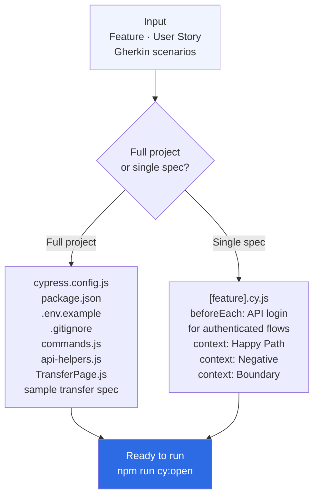

> **Navigation:** [← Skills Overview](../../README.md#skills) · [Architecture](../../docs/architecture.md) · [Usage Guide](../../docs/usage.md)

---

# Skill — cypress-test-bootstrap

Scaffold a Cypress project or generate structured E2E test files.

---

## When to use

- You need to set up a new Cypress project from scratch
- You want to add a test file for a new feature
- You want to automate test cases or Gherkin scenarios

## How to trigger

```
"Init a Cypress project for the wallet module"
"Generate a Cypress spec for the money transfer feature"
"Scaffold E2E tests for this user story"
"Create a Cypress test file for POST /wallet/cashout"
```

## What you get

**Full project:** `cypress.config.js`, `package.json`, `.env.example`,
`commands.js`, `api-helpers.js`, `e2e.js`, fixtures, `TransferPage.js`,
and a sample transfer spec file.

**Single spec:** A complete `.cy.js` file with Happy Path / Negative /
Boundary contexts, API login in `beforeEach` for authenticated flows,
and proper assertions.

## Files

| File | Purpose |
|---|---|
| `SKILL.md` | AI instructions — core logic |
| `README.md` | This file |
| `examples/cypress.config.js` | Production-ready Cypress config |
| `examples/transfer.cy.js` | Complete spec file example |
| `examples/commands.js` | Custom commands reference |
| `references/cypress-conventions.md` | Full conventions guide |
| `references/page-object-pattern.md` | Page Object Model guide |
| `scripts/init-project.sh` | CLI scaffold script |

## Related skills

- `gherkin-spec-writer` — generate Gherkin scenarios to automate
- `api-deep-analyzer` — generate test cases to implement in Cypress

---

## How it works



---

> **Navigation:** [← Skills Overview](../../README.md#skills) · [Architecture](../../docs/architecture.md) · [Examples](../../docs/examples.md#example-5--cypress-test-bootstrap)
