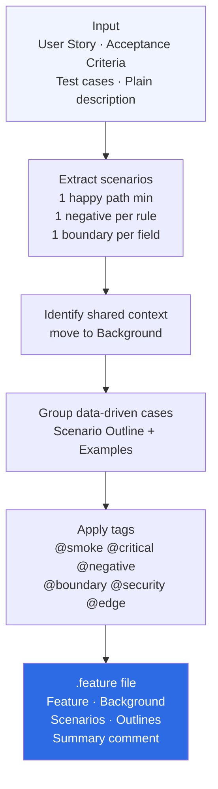

> **Navigation:** [← Skills Overview](../../README.md#skills) · [Architecture](../../docs/architecture.md) · [Usage Guide](../../docs/usage.md)

---

# Skill — gherkin-spec-writer

Generate structured, BDD-compliant Gherkin `.feature` files from any requirement.

---

## When to use

- You need a `.feature` file from a User Story or acceptance criteria
- You want to convert test cases to Gherkin BDD format
- You need a spec ready for Cucumber, Behave, or Karate

## How to trigger

```
"Write Gherkin scenarios for this user story: [paste US]"
"Generate the .feature file for this feature"
"Convert these test cases to Gherkin"
"Create BDD scenarios for: [paste requirement]"
```

## What you get

- Complete `.feature` file ready to use in any BDD framework
- Background for shared preconditions
- Scenario Outline + Examples for data-driven cases
- All scenarios tagged: @smoke / @regression / @critical / @negative / @boundary
- Summary comment block at the end

## Files

| File | Purpose |
|---|---|
| `SKILL.md` | AI instructions — core logic |
| `README.md` | This file |
| `examples/input-requirement.md` | Example requirement input |
| `examples/output-transfer.feature` | Complete transfer feature file |
| `examples/output-login.feature` | Complete login feature file |
| `references/gherkin-best-practices.md` | Complete Gherkin style guide |
| `references/gherkin-tags.md` | Tagging strategy and conventions |

## Related skills

- `qa-test-designer` — design test cases first, then convert to Gherkin
- `cypress-test-bootstrap` — automate these Gherkin scenarios in Cypress
- `playwright-test-bootstrap` — automate these Gherkin scenarios in Playwright

---

## How it works



---

> **Navigation:** [← Skills Overview](../../README.md#skills) · [Architecture](../../docs/architecture.md) · [Examples](../../docs/examples.md#example-4--gherkin-spec-writer)
