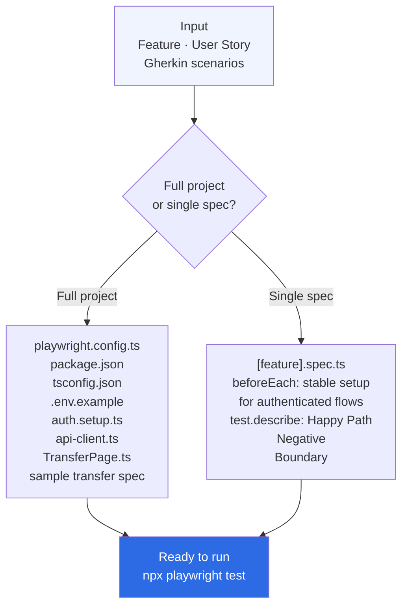

> **Navigation:** [← Skills Overview](../../README.md#skills) · [Architecture](../../docs/architecture.md) · [Usage Guide](../../docs/usage.md)

---

# Skill — playwright-test-bootstrap

Scaffold a Playwright project or generate structured E2E test files.

---

## When to use

- You need to set up a new Playwright project from scratch
- You want to add a test file for a new feature
- You want to automate test cases or Gherkin scenarios

## How to trigger

```
"Init a Playwright project for the wallet module"
"Generate a Playwright spec for the money transfer feature"
"Scaffold Playwright tests for this user story"
"Create a Playwright test file for POST /wallet/cashout"
```

## What you get

**Full project:** `playwright.config.ts`, `package.json`, `tsconfig.json`,
`.env.example`, `auth.setup.ts`, `api-client.ts`, `TransferPage.ts`,
and a sample transfer spec file.

**Single spec:** A complete `.spec.ts` file with Happy Path / Negative /
Boundary scenarios, API-auth setup for authenticated flows, and proper
Playwright assertions.

## Files

| File | Purpose |
|---|---|
| `SKILL.md` | AI instructions — core logic |
| `README.md` | This file |
| `examples/playwright.config.ts` | Production-ready Playwright config |
| `examples/auth.setup.ts` | Auth bootstrap example |
| `examples/transfer.spec.ts` | Complete spec file example |
| `references/playwright-conventions.md` | Full conventions guide |
| `references/page-object-pattern.md` | Page Object Model guide |
| `scripts/init-project.sh` | CLI scaffold script |

## Related skills

- `gherkin-spec-writer` — generate Gherkin scenarios to automate
- `api-deep-analyzer` — generate test cases to implement in Playwright
- `qa-test-designer` — design test cases before automating them

---

## How it works



---

> **Navigation:** [← Skills Overview](../../README.md#skills) · [Architecture](../../docs/architecture.md) · [Examples](../../docs/examples.md#example-6--playwright-test-bootstrap)
