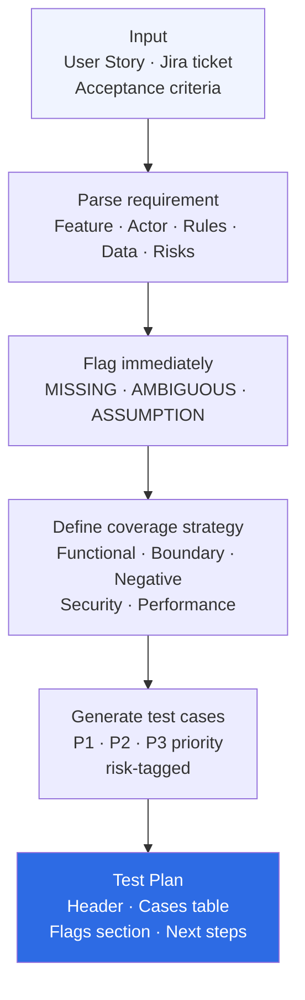

> **Navigation:** [← Skills Overview](../../README.md#skills) · [Architecture](../../docs/architecture.md) · [Usage Guide](../../docs/usage.md)

---

# Skill — qa-test-designer

Generate a complete, structured test plan from a User Story, Jira ticket, or feature description.

---

## When to use

- You received a new US or ticket and need to build the test cases
- You want full coverage — functional, boundary, negative, security
- You want risk levels and missing info flagged before you start testing

## How to trigger

```
"Write test cases for this user story: [paste US]"
"Generate a test plan for this Jira ticket"
"What should I test for this feature?"
"Create QA coverage from these acceptance criteria"
```

## What you get

1. **Test Plan Header** — feature name, reference, total cases, coverage summary
2. **Structured test cases** — ID, title, category, priority, expected result, risk
3. **Flags** — [MISSING], [AMBIGUOUS], [ASSUMPTION] clearly listed
4. **Coverage analysis** — which test types are covered and which are missing

## Files

| File | Purpose |
|---|---|
| `SKILL.md` | AI instructions — core logic |
| `README.md` | This file |
| `examples/input-user-story.md` | Example User Story input |
| `examples/output-test-plan.md` | Example generated test plan |
| `references/test-case-template.md` | Full test case format reference |
| `references/risk-classification.md` | Risk level definitions |

## Related skills

- `gherkin-spec-writer` — convert this test plan to a `.feature` file
- `api-deep-analyzer` — if the feature involves an API endpoint
- `cypress-test-bootstrap` — if automation is needed

---

## How it works



---

> **Navigation:** [← Skills Overview](../../README.md#skills) · [Architecture](../../docs/architecture.md) · [Examples](../../docs/examples.md#example-3--qa-test-designer)
